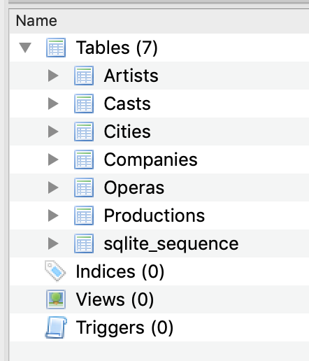
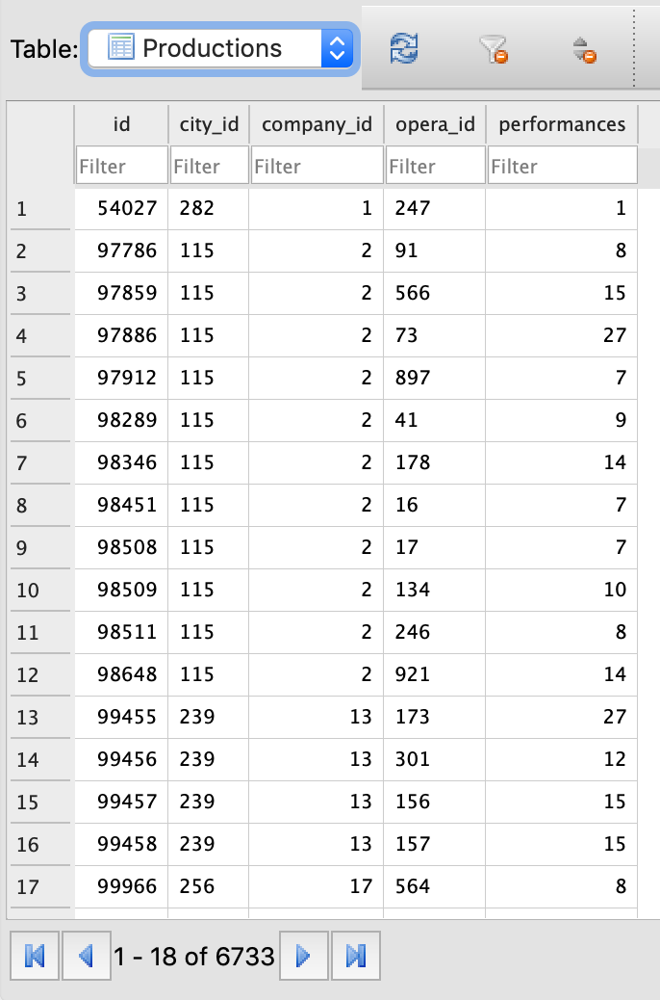
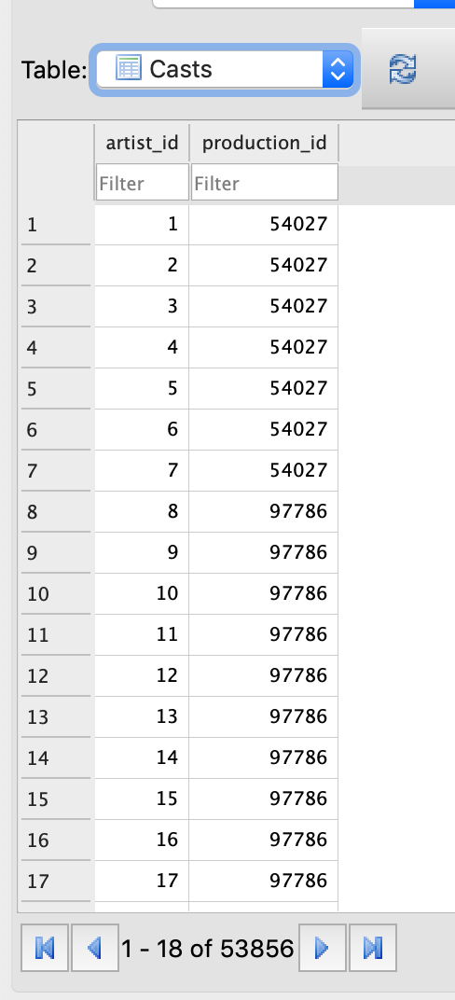
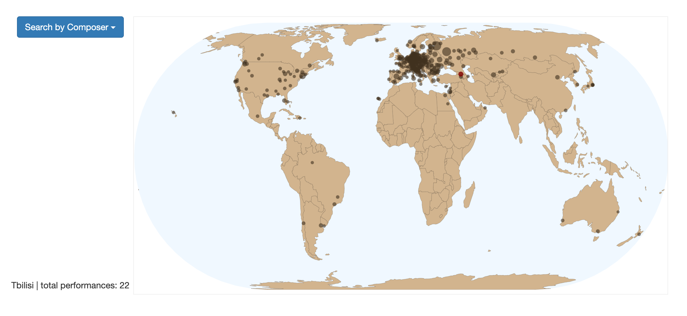
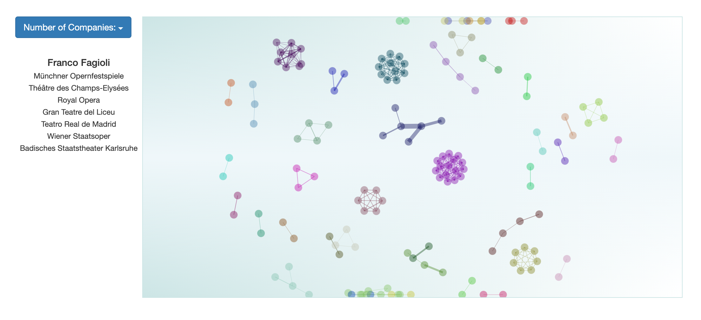

# Live Version

View the visualization of this data on **Github Pages** [here](https://zalmankelber.github.io/OperaScaper/)

# Overview

## Web Scraper

This program uses the python **urllib** module in conjunction with the **Beautiful Soup** library to scrape and parse 2019 information on worldwide opera performances from [Operabase](https://www.operabase.com/en), including a comprehensive list of all cities and opera companies for which there are records, and the number of productions and performances for each, as well as the individual opera singers, opera titles and opera composers.  For each city, geographical coordinates are obtained by searching a version of the **Google Maps API** available from the University of Michigan [Python for Everybody](https://online.umich.edu/series/python-for-everybody/) course.  The data is stored in a SQLite database in several tables so that a given search query can generally be accessed in constant time, and the program also transfers this data into three JSON objects for use in the accompanying web interactive visualization of this data.  In addition, **Postman** was used during the writing of the program in order test operabase's backend API endpoint.

## Data Visualization

This application was intentionally designed to be hosted on **Github Pages** or simply opened up in a web browser without the use of a server.  As a result, it does not rely on any server-side rendering, nor does it contain ES6 modules (the different javaScript files are encapsulated using IIFE's).  It uses the **D3 JS** library to create three interactive visualizations: a zoomable map of opera performances (that can be filtered by composer), a chart showing the differing amounts of work that singers in the industry received in 2019 and a graph showing which singers worked together across multiple companies within 2019.  TopoJson data was used for the map and was rendered in the **Eckert IV** Equal Area projection.  Some buttons and the dropdown menus are rendered with **Bootstrap.**

# Instructions for replicating

To replicate this project, or to modify the search query for different years or time ranges, download the repository and make sure that SQLite is installed.  You will need to have Beautiful Soup installed *in the parent directory* of wherever the repository is saved.  Alternatively, install bs4 in the same directory or system wide and simply delete the following code from `opera_scraper.py`

```
import os,sys,inspect
current_dir = os.path.dirname(os.path.abspath(inspect.getfile(inspect.currentframe())))
parent_dir = os.path.dirname(current_dir)
sys.path.insert(0, parent_dir)
```

Run `opera_scraper.py`, `geo_scraper.py` and then `load_json.py` in succession on the command line.  Note that the JSON data in the `js` folder will be overwritten by the last program.  To view the visualization, simply open up `index.html` in any web browser.

# About

## Data modeling

The data obtained is stored in six separate SQL tables to allow efficient memeory storage by relying on foreign keys and swift lookup.



The `Productions` table contains the greatest number of fields, while the `Casts` table uses foreign keys to show which artists appeared in given productions.




The primary keys of each table are generated automatically by SQLite with the exception of the `Artists` table, which uses the artist ID stored by operabase.  Note that the `Operas` table contains many duplicates due to alternative translations of Opera Titles (e.g. "Un ballo in maschera"/"The Masked Ball").

## Visualizations



For the zoomable map, simply click on each city to retrieve basic information (which will be displayed to the lower left).  You can use the dropdown menu on the left to filter the results by composer.  Note that as you zoom in, the circles will become smaller relative to the scale of the map, so you'll be able to navigate through operatically denser regions like Central Europe more easily.



In the graph, each draggable circle represents an artist, and is linked to other artists with whom they worked together at a certain number of separate companies during the course of 2019.  Clicking on the circle reveals the artist name and the companies they worked at.  Use the dropdown menu to change the required number of companies to form a link.

## Some interesting takewaways from the data

* Performances of most opera composers are distributed fairly evenly across the opera world, but Wagner and Tchaikovsky are both significantly more proportionally popular in their home countries than outside of them, and Mozart is more popular in northern rather than southern Europe.

* Nearly half of the aritsts featured were only engaged for a single production on operabase in 2019.

* Among the singers who worked together the most were Anna Netrebko (arguably the biggest name among currently active opera singers) and her husband Yusiv Eyvazov, with whom she performed at 10 separate venues.

# Issues and Bugs

## Regarding the data

* There seem to be issues with the cities listed by country in oeprabase.  Some cities are cryptically listed in duplicate countries.  `oepra_scraper.py` contains some fixes for this.

* Operabase maintains ID's for artists but does not do so for either operas or roles.  As a result, there's no easy way to figure out which opera titles are the same/duplicated.

* This data is for 2019 but does include full production runs that spanned more than one year that included 2019.

* This data treats all singers who appeared in a production as castmates who worked together (for the purpose of the graph), but many in fact sang during separate performances across the performance run of a production and thus did not appear on stage together.

## Regarding the visualization

* The zoomable map does not work well on mobile.

* Also: the zoomable map should be bound by the limit of the canvas when it is at 100% scale or smaller.

* The graph nodes are not draggable on mobile and cannot be dragged rapidly on desktop.
